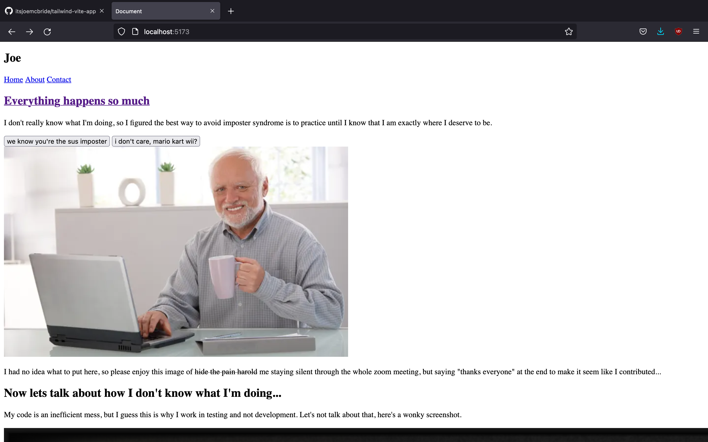

# Hey, how's it going?

A silly little project I'm working on to practice using HTML + CSS with [Tailwind](https://tailwindcss.com/) and [Vite](https://vitejs.dev/).

WIP: Deployed using [Netlify](https://netlify.app/) to support a CI/CD pipeline.
[GO TO THE WEBSITE](https://peppy-queijadas-5d4ac9.netlify.app/)
